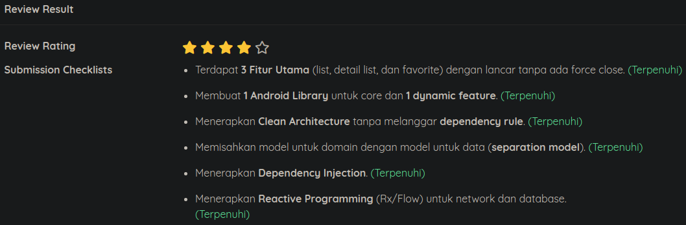

# Dog Mania

Submission for MADE class by Dicoding

## Implementing:
### Submission 1
- Clean Architecture: MVP
- Reactive Programming: Kotlin Flow
- Dependency Injection: ??Koin??
- Modularization: Library & Dynamic Feature

### Submission 2
- Apply / Implement Continuous Integration
- Good Performance
- Apply / Implement Security

## Review
### Submission 1
